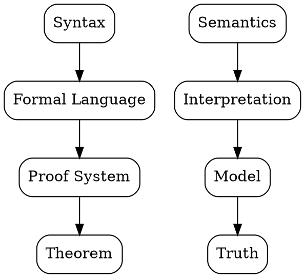

# Mathematical Logic

## The Problem
Mathematics needed a rigorous foundation to avoid paradoxes (like Russell's paradox) and to formalize what constitutes a valid proof. Natural language proofs were ambiguous and sometimes incorrect.

## Core Idea
Mathematical logic uses formal languages with precise syntax and semantics to study mathematical reasoning, proof, and computation. It provides the foundation for computability theory and theoretical computer science.

## How It Works
Mathematical logic consists of:
1. **Propositional logic** — simple true/false statements connected by AND, OR, NOT
2. **First-order logic** — adds quantifiers (∀, ∃) and predicates over objects
3. **Proof theory** — formal systems for deriving theorems
4. **Model theory** — relationships between formal languages and their interpretations
5. **Recursion theory** — what is computable (directly led to computability theory)

Church's lambda calculus and Turing's machines both emerged from mathematical logic investigations.

## Visual Explanation

## Key Properties
- **Soundness** — only true statements can be proved
- **Completeness** — all true statements can be proved (for first-order logic, Gödel proved this)
- **Decidability** — is there an algorithm to determine if a statement is provable? (answer: no, for first-order logic)

## Connections
- Builds into: [[theory-of-computation|Theory of Computation]] — computability emerged from logic
- Builds into: [[lambda-calculus|Lambda Calculus]] — logical foundation for functional programming
- Builds into: [[turing-machine|Turing Machine]] — Turing's work was in mathematical logic
- Builds into: [[algorithm|Algorithm]] — formal procedures for computation
- Related: [[formal-language-theory|Formal Language Theory]] — languages defined by logical grammars
- Related: [[rices-theorem|Rice's Theorem]] — all non-trivial semantic properties are undecidable

## Edge Cases & Gotchas
- Gödel's incompleteness theorems — any sufficiently powerful logical system cannot be both consistent and complete
- First-order logic is undecidable (no algorithm can determine truth of arbitrary statements)
- Second-order logic is even more expressive but loses completeness

## Sources
- [[theory-of-computation-wikipedia|Theory of Computation Wikipedia]]
