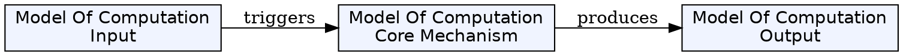
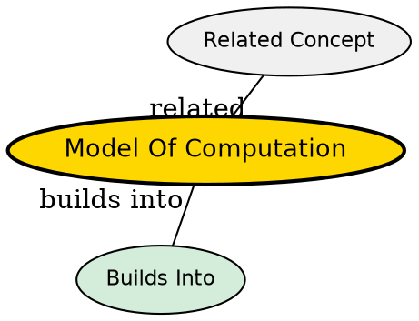

## The Problem

How do we rigorously study computation without being tied to specific hardware implementations?

## Core Idea

A model of computation is a mathematical abstraction of a computer used to formally analyze what problems can be solved and how efficiently.

## How It Works

Computer scientists work with various models:

- **Turing machine** - most commonly examined, simple to formulate and analyze
- **Lambda calculus** - function-based computation
- **Register machine** - idealized computer with numbered registers
- **μ-recursive functions** - mathematical function definition

The Turing machine is preferred because it is simple to formulate, can be analyzed to prove results, and represents what many consider the most powerful "reasonable" model of computation (Church-Turing thesis).

## Key Properties

- Mathematical abstraction of computers
- Used to prove results about computability and complexity
- Different models have different capabilities but are often equivalent
- Enables rigorous analysis without hardware dependencies

## Visual Explanation

## Semantic Network

## Connections

- Built from: [[turing-machine|Turing Machine]], [[lambda-calculus|Lambda Calculus]], [[register-machine|Register Machine]]
- Builds into: [[computability-theory|Computability Theory]], [[computational-complexity-theory|Computational Complexity Theory]]
- Related: [[theory-of-computation|Theory of Computation]], [[algorithm|Algorithm]]

## Edge Cases & Gotchas

- All reasonable models of computation are equivalent (Church-Turing thesis)
- The infinite memory of Turing machines is idealized--any decidable problem needs only finite memory