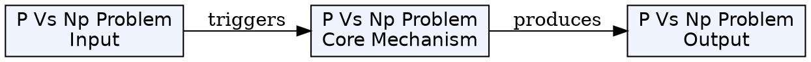
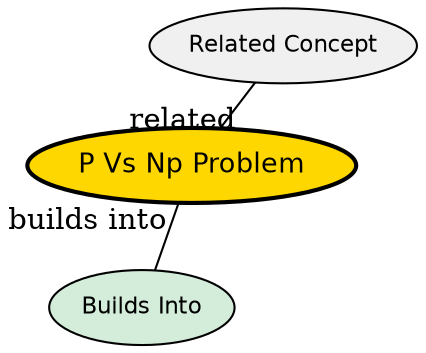

## The Problem

If you can verify a solution quickly, can you also find a solution quickly?

## Core Idea

The P vs NP problem asks whether every problem whose solution can be verified in polynomial time can also be solved in polynomial time. It is one of the seven Millennium Prize Problems with a $1 million reward.

## How It Works

- **P (Polynomial)** - problems solvable in polynomial time
- **NP (Non-deterministic Polynomial)** - problems verifiable in polynomial time

All P problems are in NP, but whether NP ⊆ P (i.e., P = NP) is unknown. If P = NP, problems like factorization, SAT, and many optimization problems would become efficiently solvable.

## Key Properties

- One of the seven Millennium Prize Problems
- Asks if P = NP
- If true, many hard problems become easy
- Current consensus: probably false
- Has profound implications for cryptography, optimization, AI

## Visual Explanation

## Semantic Network

## Connections

- Built from: [[computational-complexity-theory|Computational Complexity Theory]], [[np-complete|NP-Complete]]
- Related: [[polynomial-time|Polynomial Time]], [[nondeterministic-turing-machine|Non-deterministic Turing Machine]], [[sat-problem|SAT Problem]]

## Edge Cases & Gotchas

- Even if P = NP, the polynomial might be too large to be practical
- Cryptography assumes P ≠ NP
## Why This Matters

The P vs NP problem is the most important open problem in computer science. Its resolution would revolutionize computing, cryptography, and our ability to solve complex optimization problems.