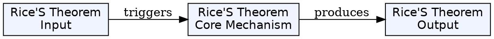
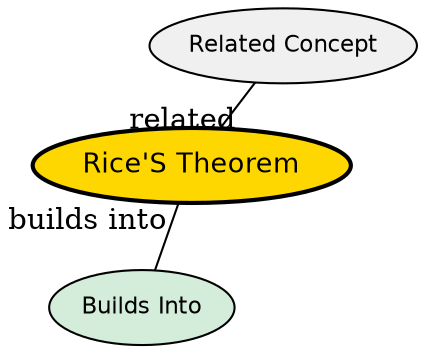

## The Problem

Can we automatically determine non-trivial properties of programs?

## Core Idea

Rice's theorem states that for all non-trivial properties of partial functions (computed by Turing machines), it is undecidable whether a given Turing machine computes a partial function with that property.

## How It Works

A property is "non-trivial" if it is not always true or always false for all Turing machines. Examples:

- "Does this machine's output equal its input?"
- "Does this machine output a prime number?"
- "Does this machine halt on empty input?"

All such properties are undecidable--proving many problems are unsolvable without case-by-case analysis.

## Key Properties

- Proved by Henry Gordon Rice in 1953
- Applies to all non-trivial properties of partial functions
- Generalizes the halting problem to many properties
- Any property about the function a program computes is undecidable

## Visual Explanation

## Semantic Network

## Connections

- Built from: [[turing-machine|Turing Machine]], [[halting-problem|Halting Problem]]
- Builds into: [[computability-theory|Computability Theory]]
- Related: [[undecidability|Undecidability]], [[computational-complexity-theory|Computational Complexity Theory]]

## Edge Cases & Gotchas

- The theorem applies to properties of the function computed, not the program's syntax
- Trivial properties (always true/false) are still decidable
## Why This Matters

Rice's theorem tells us that any non-trivial property of program behavior is undecidable. This fundamental limit applies to program verification, malware detection, and many other areas.