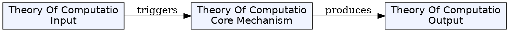
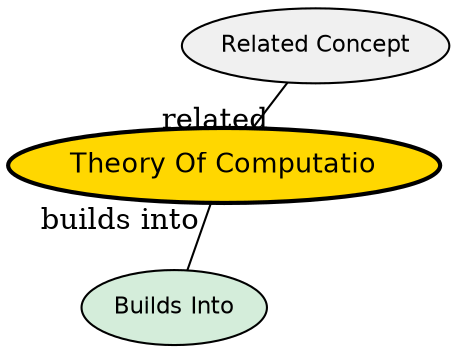

## Source Overview

Wikipedia article on Theory of Computation, covering the branch of theoretical computer science that studies what problems can be solved using algorithms and how efficiently.

## Concepts Extracted (13 total)

1. **Theory of Computation** -- The overarching field studying algorithmic solvability and efficiency
2. **Model of Computation** -- Mathematical abstractions of computers for formal analysis
3. **Turing Machine** -- The most powerful reasonable model of computation
4. **Automata Theory** -- Study of abstract machines and what problems they can solve
5. **Computability Theory** -- Determines which problems are solvable at all
6. **Halting Problem** -- The undecidable problem of whether a program halts
7. **Rice's Theorem** -- All non-trivial properties of programs are undecidable
8. **Computational Complexity Theory** -- Studies how efficiently problems can be solved
9. **Formal Language Theory** -- Mathematical description and classification of languages
10. **Chomsky Hierarchy** -- Classification of formal languages by computational power
11. **Lambda Calculus** -- Function-based model of computation
12. **Church-Turing Thesis** -- Thesis that Turing machines capture all computable functions
13. **Big O Notation** -- Asymptotic notation for comparing algorithm efficiency
14. **P vs NP Problem** -- Open question about verification vs solution efficiency
15. **Alan Turing** -- Pioneer who founded computability theory

## Key Takeaways

- The field has three major branches: automata theory, computability theory, and computational complexity theory
- The fundamental question is: "What are the fundamental capabilities and limitations of computers?"
- Turing machines are the standard model due to their simplicity and power
- Many important problems are provably undecidable (halting problem, Rice's theorem)
- P vs NP is the most important open problem in computer science

## Visual Explanation

## Semantic Network

## Connections to Existing Concepts

The new concepts integrate with the existing wiki by adding theoretical foundations that underpin algorithms and computational models mentioned in the existing knowledge base.

## Contradictions

None identified.

## Synthesis Opportunities

Could create synthesis comparing computability theory vs computational complexity theory, or explaining how the Chomsky hierarchy relates to automata models.