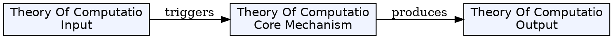
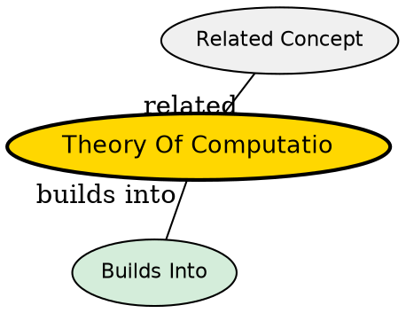

## The Problem

What are the fundamental capabilities and limitations of computers? Which problems can be solved by algorithms, and how efficiently?

## Core Idea

Theory of computation is the branch of theoretical computer science and mathematics that studies what problems can be solved on a model of computation using an algorithm, how efficiently they can be solved, and to what degree.

## How It Works

The field is divided into three major branches that work together to answer the core question:

- **Automata theory** studies abstract machines and what languages they can recognize
- **Computability theory** determines which problems are solvable at all
- **Computational complexity theory** measures how efficiently problems can be solved

Computer scientists use mathematical abstractions called models of computation to perform rigorous analysis. The most common is the Turing machine.

## Key Properties

- Deals with algorithmic solvability and efficiency
- Uses mathematical abstraction of computers (models of computation)
- Has three major branches linked by the fundamental question of computational limits
- Separated from mathematics in the last century with its own conferences and awards

## Visual Explanation

## Semantic Network

## Connections

- Built from: [[mathematical-logic|Mathematical Logic]]
- Builds into: [[computational-complexity-theory|Computational Complexity Theory]], [[automata-theory|Automata Theory]], [[computability-theory|Computability Theory]]
- Related: [[algorithm|Algorithm]], [[model-of-computation|Model of Computation]]

## Edge Cases & Gotchas

- The potentially infinite memory of a Turing machine seems unrealizable, but any decidable problem only requires finite memory
- The field abstracts away practical constraints to focus on fundamental limits
## Why This Matters

Understanding computational limits informs what problems are tractable, guides algorithm design, and shapes the entire field of computer science.