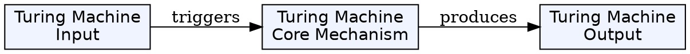
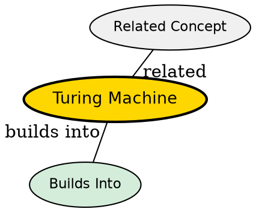

## The Problem

What is the most powerful reasonable model of computation that can be rigorously analyzed?

## Core Idea

A Turing machine is an abstract machine that consists of an infinite tape, a read-write head, and a finite state control. It can simulate any algorithm and is the standard model for studying computability.

## How It Works

The machine operates as follows:

1. Reads the symbol under the head from the infinite tape
2. Based on current state and symbol, writes a new symbol
3. Moves the head left or right
4. Transitions to a new state or halts

Any problem that can be solved by a computer can be solved by a Turing machine. The Church-Turing thesis states that this model captures all computable functions.

## Key Properties

- Most powerful "reasonable" model of computation
- Simple to formulate, analyze, and prove results
- Can simulate any algorithm
- Despite infinite tape, any decidable problem needs only finite memory
- Represents the foundation of computability theory

## Visual Explanation

## Semantic Network

## Connections

- Built from: [[model-of-computation|Model of Computation]]
- Builds into: [[computability-theory|Computability Theory]], [[halting-problem|Halting Problem]], [[rices-theorem|Rice's Theorem]]
- Contrasts with: [[finite-automaton|Finite Automaton]], [[lambda-calculus|Lambda Calculus]]
- Related: [[church-turing-thesis|Church-Turing Thesis]]

## Edge Cases & Gotchas

- The infinite tape is an abstraction--in practice, any useful computation needs finite memory
- Not the only model; lambda calculus, register machines are all equivalent
## Why This Matters

The Turing machine is the foundation for all computability theory. It defines what we mean by "computable" and provides the tool to prove limits like the undecidability of the halting problem.