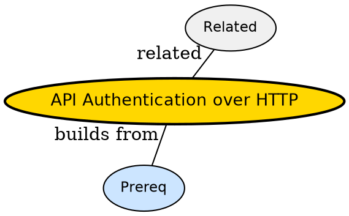

## The Problem

How does server know request is from logged-in user without storing session on server?

## Formal Definition

Per Wikipedia: "API authentication over HTTP often uses token in Authorization header -- Bearer JWT or session cookie -- verified per request."

## Explanation

Like wristband at festival -- gate checks band each entry, does not remember your face.

## How It Works

1. Client logs in, gets token
2. Client sends Authorization: Bearer <jwt> each request
3. Server verifies signature/expiry
4. Server loads principal
5. Returns 401 if invalid

## Visual Explanation


## Semantic Network



## Key Properties

- Stateless -- token carries claims
- Short expiry plus refresh
- Bearer must be over HTTPS
- Revocation needs denylist

## Real-World Example

```python
Authorization: Bearer eyJ...
```

## Connections

- **Built from:** [[http-headers|HTTP Headers]] -- auth travels in header
- **Related:** [[http-status-codes|HTTP Status Codes]] -- 401/403
- **Related:** [[statelessness|Statelessness]] -- stateless auth fits
- **Builds into:** [[cors|CORS]] -- creds needs CORS allow

## Edge Cases & Gotchas

- Storing JWT in localStorage XSS risk
- Long-lived token without refresh
