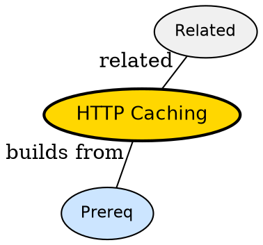

## The Problem

Why does API return 304 Not Modified instead of JSON?

## Formal Definition

Per Wikipedia: "HTTP caching lets clients and intermediaries store responses and revalidate via ETag, Last-Modified, Cache-Control and 304."

## Explanation

Caching is leftovers -- second visit eats from fridge if still fresh, else asks if still good.

## How It Works

1. Server sends Cache-Control and ETag
2. Client caches response
3. Next request sends If-None-Match
4. Server returns 304 if unchanged
5. Client uses cached body

## Visual Explanation


## Semantic Network



## Key Properties

- ETag strong validator
- Cache-Control max-age governs freshness
- 304 saves bandwidth

## Real-World Example

```python
Cache-Control: max-age=60
ETag: "abc"
```

## Connections

- **Built from:** [[http-headers|HTTP Headers]] -- caching via headers
- **Related:** [[http-status-codes|HTTP Status Codes]] -- 304 code
- **Builds into:** [[http-request-response-cycle|HTTP Request Response Cycle]] -- caching short-circuits cycle
- **Related:** [[statelessness|Statelessness]] -- caching keeps stateless

## Edge Cases & Gotchas

- Caching with auth -- private vs public
- Stale while revalidate confusion
