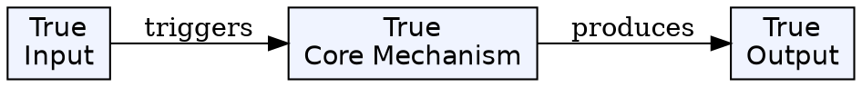
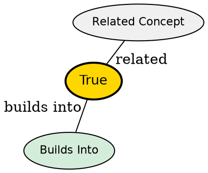

## The Problem

The message body carries the core data, but the request/response needs metadata--content type, authentication, caching rules, client info--that shouldn't be mixed with the payload.

## Core Idea

Headers are key-value pairs providing metadata about the request or response. They're like the address on a parcel--metadata that lets intermediaries process messages without opening the body.

## Categories

### Request Headers

Sent by the client to describe the request:

- `Authorization`: Credentials (bearer token)
- `Accept`: Expected content types (JSON, HTML)
- `User-Agent`: Client identification

### General Headers

Used in both requests and responses:

- `Date`: Timestamp
- `Cache-Control`: Caching directives (no-cache, max-age)
- `Connection`: Keep-alive or close

### Representation Headers

Describe the body content:

- `Content-Type`: Media type (application/json)
- `Content-Length`: Size in bytes
- `Content-Encoding`: Compression (gzip, deflate)
- `ETag`: Unique identifier for caching

### Security Headers

Enhance security:

- `Strict-Transport-Security` (HSTS): Enforce HTTPS
- `Content-Security-Policy` (CSP): Restrict content sources
- `X-Frame-Options`: Prevent clickjacking
- `Set-Cookie`: With HttpOnly/Secure flags

## Visual Explanation

## Semantic Network

## Connections

- **Built from:** [[http|HTTP]] (the message structure)
- **Related to:** [[http-status-codes|HTTP Status Codes]] (response metadata)
- **Related to:** [[cors|CORS]] (uses headers for cross-origin control)
- **Related to:** HTTP Methods (define what the request wants to do)

## Edge Cases & Gotchas

- Custom headers can use `X-` prefix but this is now discouraged
- Headers are case-insensitive but conventionally Title-Case
- Large header values can cause issues with some proxies