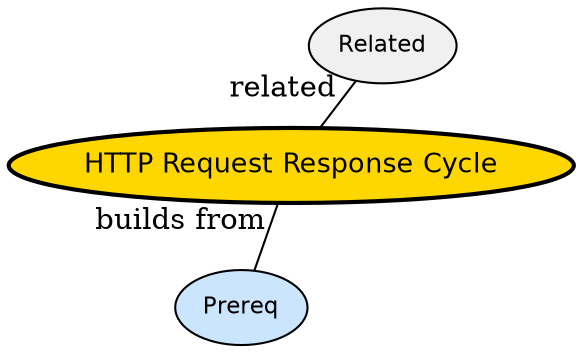

## The Problem

What actually happens between fetch() and response.json()?

## Formal Definition

Per Wikipedia: "The request-response cycle is the full round trip -- DNS, TCP, TLS, HTTP request, server handler, HTTP response, browser parse."

## Explanation

Like ordering food -- find restaurant address, travel there, place order, wait for kitchen, carry tray back.

## How It Works

1. Resolve host via DNS
2. Open TCP then TLS
3. Send HTTP request line+headers+body
4. Server routes and handles
5. Return status+headers+body

## Visual Explanation


## Semantic Network



## Key Properties

- Stateless per request
- Keep-Alive reuses TCP
- 3 RTT before first byte with TLS

## Real-World Example

```python
curl -v https://api.example.com
```

## Connections

- **Built from:** [[http|HTTP]] -- cycle implements HTTP
- **Built from:** [[http-headers|HTTP Headers]] -- headers travel in cycle
- **Related:** [[http-status-codes|HTTP Status Codes]] -- status returned
- **Builds into:** [[cors|CORS]] -- CORS checked in cycle

## Edge Cases & Gotchas

- Assuming one TCP per request -- keep-alive reuses
- Forgetting preflight in cycle
