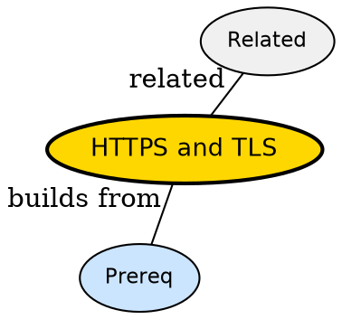

## The Problem

How does HTTP become tamper-proof on public WiFi?

## Formal Definition

Per Wikipedia: "HTTPS is HTTP over TLS -- handshake negotiates cipher, verifies cert, then encrypts headers and body."

## Explanation

Like sending letter in locked box -- only server has key, postman cannot read.

## How It Works

1. ClientHello with ciphers
2. Server replies cert + ServerHello
3. Client verifies CA chain
4. Key exchange derives session key
5. HTTP encrypted inside TLS record

## Visual Explanation


## Semantic Network



## Key Properties

- Cert binds domain to key
- TLS terminates at load balancer often
- Mixed http/https leaks
- Session resumption saves RTT

## Real-World Example

```python
openssl s_client -connect api.example.com:443
```

## Connections

- **Built from:** [[http|HTTP]] -- HTTPS wraps HTTP
- **Related:** [[http-request-response-cycle|HTTP Request Response Cycle]] -- cycle includes TLS
- **Related:** [[cors|CORS]] -- CORS still applies over HTTPS
- **Builds into:** [[http-headers|HTTP Headers]] -- headers encrypted

## Edge Cases & Gotchas

- Self-signed cert trusted by client -- breaks auth
- Terminating TLS but logging plaintext
