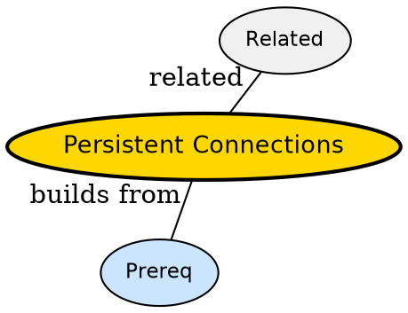

## The Problem

Why is second API call faster than first?

## Formal Definition

Per Wikipedia: "Persistent connections keep TCP/TLS open after response so next HTTP exchange skips handshake -- called keep-alive."

## Explanation

Like keeping phone line open -- second question does not need redial.

## How It Works

1. First request does TCP+TLS+HTTP
2. Server replies with Connection: keep-alive
3. Socket stays open idle
4. Second request reuses socket
5. Timeout closes after idle

## Visual Explanation


## Semantic Network



## Key Properties

- Saves 1-2 RTT per reuse
- Needs idle timeout
- Head-of-line blocking in HTTP/1.1
- HTTP/2 multiplexes over one

## Real-World Example

```python
Connection: keep-alive
```

## Connections

- **Built from:** [[http|HTTP]] -- persistence is HTTP feature
- **Related:** [[http-request-response-cycle|HTTP Request Response Cycle]] -- cycle benefits
- **Related:** [[http-versions|HTTP Versions]] -- HTTP/1.1 added keep-alive
- **Contrasts with:** [[statelessness|Statelessness]] -- stateless but transport reused

## Edge Cases & Gotchas

- Leaking sockets -- no close on error
- Pooling without limit -- too many open
