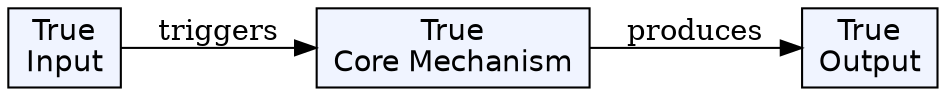
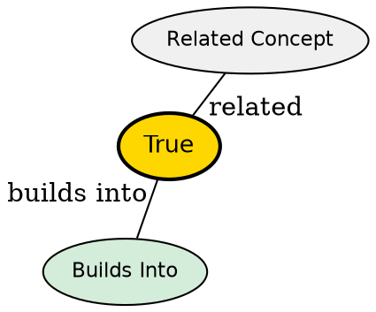

## The Problem

Server memory grows without bound if every interaction must be preserved. Scaling becomes impossible when specific servers must handle specific clients.

## Core Idea

Each HTTP request contains all information needed for the server to process it. The server has no memory of past requests--every interaction is independent.

## How It Works

When a client requests a resource, the request includes authentication credentials, headers, URL, and body. After the server responds, it forgets the interaction entirely. The next request is treated as completely new.

```java
// Every request must include auth - server has no memory
@GetMapping("/api/users/{id}")
public ResponseEntity<User> getUser(
    @PathVariable Long id,
    @RequestHeader("Authorization") String token) {
    // Token must be sent every time - no session from previous requests
    return ResponseEntity.ok(userService.findById(id));
}
```

## Key Properties

- **Simplicity**: No session store, cleanup, or synchronization needed
- **Scalability**: Any server can handle any request; load balancing is trivial
- **Resilience**: Server crash doesn't affect client state--no session to restore


## Visual Explanation



## Semantic Network


## Connections

- **Built from:** [[http|HTTP]] (the protocol that enforces this property)
- **Related:** [[rest-api|REST Architecture]] (stateless APIs follow HTTP pattern)
- **Contrasts with:** Circuit Switching (stateful connection holding)
- **Related:** Broadcast Links (one-to-many pattern)

## Edge Cases & Gotchas

- Stateful applications require tokens/cookies sent with every request
- Without state management, users would re-authenticate on every action
- Performance cost of re-sending data is acceptable given scale benefits