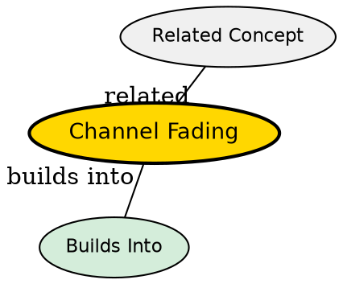

## The Problem
Radio signals traveling through the air do not maintain constant strength. Due to constructive and destructive interference from multipath propagation, and due to shadowing from obstacles, the received signal strength fluctuates rapidly over time. These fluctuations can cause the signal to drop below the receiver's sensitivity threshold, causing communication failures.

## Core Idea
Channel fading refers to variations in received signal amplitude and phase over time. It occurs because multiple copies of the transmitted signal (arriving via different paths) combine constructively or destructively at the receiver, and because the transmission path itself changes as objects move in the environment.

## How It Works
1. The transmitted signal travels via multiple paths (multipath propagation)
2. Each copy has a different phase (determined by path length)
3. When copies add up in phase, they create constructive interference -- signal strength increases
4. When copies are out of phase, they create destructive interference -- signal strength decreases
5. As the mobile device moves, the relative path lengths change continuously, causing rapid strength fluctuations

Fading typically follows statistical distributions: Rayleigh fading when there is no dominant direct path (typical in urban environments), Rician fading when there is a dominant line-of-sight component.

## Key Properties
- Fast fading: Rapid fluctuations due to multipath (changes over milliseconds as the device moves)
- Slow fading (shadowing): Gradual changes due to large obstacles blocking the signal path
- Depth of fading: Can cause signal to drop 20–30 dB below average, making communication impossible without error correction
- Frequency-selective fading: Different frequencies fade differently if the channel bandwidth exceeds the coherence bandwidth
- Time-varying: The channel changes continuously as the device moves

## Visual Explanation

## Semantic Network

## Connections
- Built from: [[multipath-propagation|Multipath Propagation]] -- fading is caused by the constructive/destructive superposition of multipath signals
- Related: [[diversity-antenna|Diversity Antenna]] -- diversity techniques combat fading by receiving signals via multiple independent paths
- Related: [[spread-spectrum|Spread Spectrum]] -- spreading the signal over a wide bandwidth reduces the impact of narrowband fading
- Related: [[modulation|Modulation]] -- robust modulation schemes (like PSK with coding) are more resilient to fading

## Edge Cases & Gotchas
- Fading is most severe at certain speeds -- too slow and the channel doesn't change enough for diversity; too fast and tracking becomes impossible
- Fading margins (extra signal power) must be built into link budgets to ensure reliable communication
- Simple path loss models (free space) do not account for fading -- realistic models need shadowing and multipath components
- Diversity combining (selection, maximal ratio combining) can provide 10–30 dB of improvement