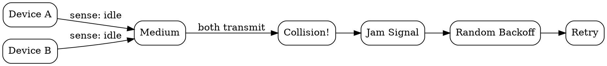

## The Problem
In shared wired networks (like early Ethernet), multiple devices share the same physical medium. If two devices transmit simultaneously, their signals collide and become corrupted. There was no mechanism to detect and recover from these collisions.

## Core Idea
CSMA/CD is a MAC protocol where devices listen before transmitting (carrier sense), and if a collision is detected during transmission, all devices stop, wait a random time, and retry. It was the foundation of classic Ethernet (IEEE 802.3).

## How It Works
1. **Listen** — device checks if medium is idle before transmitting
2. **Transmit** — if idle, start transmitting while continuously monitoring for collisions
3. **Collision detected** — if collision detected (voltage exceeds normal), send jam signal
4. **Backoff** — wait random time using exponential backoff algorithm, then retry

The maximum network diameter is limited by the "slot time" — the time to detect a collision from the farthest device.

## Visual Explanation

## Key Properties
- **Carrier sense** — listen before transmit (reduces but doesn't eliminate collisions)
- **Collision detection** — detect during transmission (wired networks only)
- **Exponential backoff** — after each collision, wait longer (reduces repeat collisions)
- **Half-duplex** — only one device can transmit at a time

## Connections
- Built from: [[hidden-terminal-problem|Hidden Terminal Problem]] — CSMA variants try to solve similar problems
- Contrasts with: [[csma-ca|CSMA/CA]] — wireless uses collision avoidance (can't detect collisions)
- Related: [[maca|MACA]] — wireless alternative that influenced 802.11
- Related: [[multiplexing|Multiplexing]] — MAC protocols enable shared medium access
- Related: [[wired-networks|Wired Networks]] — CSMA/CD is primarily for wired Ethernet

## Edge Cases & Gotchas
- Only works on wired networks — wireless can't detect collisions (hidden terminal problem)
- Maximum network length limited by propagation delay (must detect collision in time)
- Modern Ethernet switches use full-duplex — no collisions, CSMA/CD obsolete in practice

## Sources
- [[wireless-n-summary|Wireless Networks Source Summary]]
