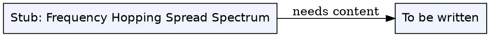
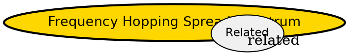

## The Problem

Auto-created stub for broken link `[[frequency-hopping-spread-spectrum]]` -- needs human content. This page was referenced 2 times and was missing, so a stub was created to keep the graph connected.

## Formal Definition

Per Wikipedia: "To be written."

## Explanation

Stub -- fill with plain language explanation of frequency hopping spread spectrum.

## How It Works

1. To be written.
2. To be written.
3. To be written.
4. To be written.

## Visual Explanation



## Semantic Network



## Key Properties

- To be written.

## Real-World Example

```python
# TODO: add example for Frequency Hopping Spread Spectrum
```

## Connections

- **Related:** [[index|Index]] -- auto stub, needs proper links to wiki/wireless-n/spread-spectrum.md, wiki/wireless-n/bluetooth.md

## Edge Cases & Gotchas

- To be written.
- To be written.
