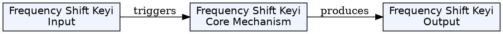
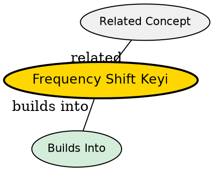

## The Problem
Standard FSK (Frequency Shift Keying) uses two distinct frequencies to represent binary 0 and 1. However, when the data transitions between bits, the FSK receiver resets the carrier wave to start fresh at every bit boundary. This causes sharp phase discontinuities (jumps) in the waveform, which generates high-frequency noise called "frequency splatter." This wastes bandwidth and causes interference in adjacent channels.

## Core Idea
FSK is a digital modulation technique where binary data is represented by shifting the carrier frequency between two values: a high frequency for bit 1, and a low frequency for bit 0. The frequency shift must be detectable by the receiver, and the minimum separation determines orthogonality.

## How It Works
1. The carrier frequency is switched between two values: f₁ for bit 1, f₀ for bit 0
2. At each bit transition, the standard FSK receiver generates a fresh carrier wave starting from zero phase
3. If the previous bit ended at a negative phase and the new bit starts from zero, a sharp discontinuity (phase jump) occurs
4. These discontinuities create frequency components outside the assigned bandwidth -- "splatter"
5. The frequency separation Δf = |f₁ - f₀| determines orthogonality and bandwidth efficiency

Minimum orthogonal separation: Δf = 1/(2T) where T is the bit duration. This is the minimum shift keying (MSK) condition.

## Key Properties
- Binary modulation: two frequencies, easy to detect
- Frequency separation determines orthogonality and bandwidth
- Standard FSK (with phase reset) has phase discontinuities at bit boundaries
- Phase discontinuities generate high-frequency splatter, wasting bandwidth
- MSK is the continuous-phase form of FSK with minimum orthogonal frequency separation
- GMSK (Gaussian MSK) is a filtered version of MSK used in GSM

## Visual Explanation

## Semantic Network

## Connections
- Built from: [[modulation|Modulation]] -- FSK is a specific digital modulation technique
- Built from: [[minimum-shift-keying|MSK]] -- MSK is the continuous-phase version of FSK that eliminates the phase reset problem
- Related: [[gsm|GSM]] -- GSM uses GMSK (Gaussian MSK), an MSK variant, as its modulation scheme
- Related: [[phase-shift-keying|PSK]] -- another digital modulation technique that avoids phase reset by using phase changes instead
- Related: [[amplitude-shift-keying|ASK]] -- digital modulation using amplitude changes

## Edge Cases & Gotchas
- Standard FSK is rarely used in modern systems due to bandwidth inefficiency
- All modern cellular systems use continuous-phase schemes (MSK, GMSK, QPSK)
- The phase reset problem means receiver complexity is higher for standard FSK
- GMSK applies a Gaussian filter before modulation to further smooth the frequency transitions