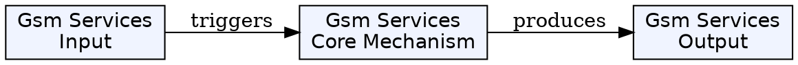
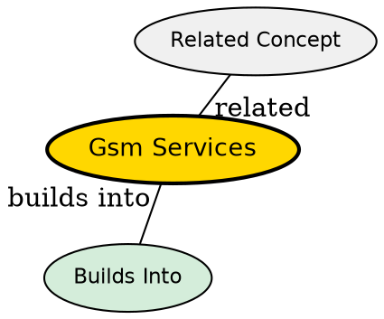

## The Problem
A cellular network must offer more than just voice calls. Users need data services, emergency calls, messaging, and supplementary features like call forwarding. GSM defines three layered service categories to comprehensively cover all communication needs from raw data transport to end-user applications.

## Core Idea
GSM defines three categories of services: bearer services (transparent data transport at Layer 1–3), tele services (end-user applications at all 7 OSI layers), and supplementary services (enhancements over basic telephony like call forwarding and call waiting).

## How It Works

**Bearer Services:**
- Transparent transmission of data between network interfaces
- Up to 9.6 kbps for data; synchronous or asynchronous
- Transparent: constant delay, FEC only; uses only Physical layer
- Non-transparent: RLP protocol with ARQ, error correction; uses Layers 2–3
- Interworks with PSTN, ISDN, and X.25 packet data networks

**Tele Services:**
- Encrypted voice transmission (primary service)
- SMS (Short Message Service): up to 160 characters; uses signaling channels
- EMS (Enhanced Message Service): larger messages, formatted text, images, tones
- MMS (Multimedia Message Service): larger pictures, video clips
- Group 3 fax: standard ITU-T T.4/T.30 fax over voice channels
- Emergency number (112): highest priority, free, works throughout coverage area

**Supplementary Services:**
- Caller ID, call forwarding, call waiting, call hold
- Closed user groups: company-specific sub-networks
- Multi-party communication, call barring
- VLRs and other carrier-specific services

## Key Properties
- Bearer services: Layer 1–3 of OSI model
- Tele services: all 7 OSI layers, end-to-end
- SMS uses dedicated signaling channels, not voice channels
- MMS evolved from SMS and is used for rich mobile content
- Emergency services pre-empt other calls and are free

## Visual Explanation

## Semantic Network

## Connections
- Built from: [[gsm-architecture|GSM Architecture]] -- the GSM infrastructure delivers these services
- Built from: [[gsm-air-interface|GSM Air Interface]] -- bearer services are transported over Um interface
- Related: [[gsm-protocols|GSM Protocols]] -- the protocol layers that implement these services
- Related: [[hlr|HLR]] -- HLR stores subscribed service profiles
- Related: [[short-message-service|SMS]] -- one of GSM's tele services

## Edge Cases & Gotchas
- SMS was designed for network operator messaging but became a massive revenue generator
- MMS requires WAP infrastructure and is distinct from SMS
- Bearer services in early GSM (9.6 kbps) were very slow by modern standards
- GPRS (2.5G) dramatically improved bearer services with packet switching