## The Problem
First-generation cellular systems (1G) were analog, insecure, and lacked international roaming standards. There was no unified digital cellular standard for Europe and the world.

## Core Idea
GSM is the 2G digital cellular standard that introduced digital encryption, international roaming, and SIM cards. It defines the complete architecture for digital mobile communication.

## How It Works
GSM operates in the 900 MHz and 1800 MHz bands (different regions vary). The system uses:
1. **TDMA/FDMA hybrid** — time division and frequency division multiplexing
2. **GMSK modulation** — Gaussian Minimum Shift Keying for spectrally efficient transmission
3. **Three subsystems**: RSS (radio), NSS (network switching), OSS (operations)
4. **SIM cards** — removable subscriber identity module for portability

Key processes: location updates, handoff, authentication, and encryption all managed by the NSS.

## Visual Explanation

```dot
digraph G {
    rankdir=TB;
    node [shape=box, style=rounded];
    
    subgraph RSS {
        "Mobile Station (MS)" -> "Base Transceiver Station (BTS)";
        "BTS" -> "Base Station Controller (BSC)";
    }
    
    subgraph NSS {
        "BSC" -> "Mobile Switching Center (MSC)";
        "MSC" -> "Home Location Register (HLR)";
        "MSC" -> "Visitor Location Register (VLR)";
        "MSC" -> "Authentication Center (AUC)";
        "MSC" -> "Equipment Identity Register (EIR)";
    }
    
    "MSC" -> "Public Switched Telephone Network (PSTN)";
}
```

## Key Properties
- Digital encryption (A5/1, A5/2, A5/3) for voice and data privacy
- SIM cards enable subscriber portability across devices
- International roaming through HLR/VLR architecture
- GPRS (2.5G) adds packet-switched data on top of GSM's circuit-switched foundation
- Uses FDD (Frequency Division Duplex) for uplink/downlink separation

## Connections
- Built from: [[wireless-network|Wireless Network]] — GSM operates over wireless radio
- Built from: [[frequency-shift-keying|Frequency Shift Keying]] — GSM uses GMSK (Gaussian MSK)
- Builds into: [[gsm-architecture|GSM Architecture]] — detailed subsystem breakdown
- Builds into: [[gsm-services|GSM Services]] — telephony, data, supplementary services
- Contrasts with: [[code-division-multiple-access|CDMA]] — GSM uses TDMA, CDMA uses spread spectrum
- Related: [[gprs|GPRS]] — packet-switched extension to GSM (2.5G)

## Edge Cases & Gotchas
- A5/1 encryption was broken — modern attacks can decrypt GSM traffic in real-time
- GSM operates in multiple frequency bands globally (850/900/1800/1900 MHz) — devices must support regional bands
- Circuit-switched nature makes GSM inefficient for data — GPRS/EDGE added later