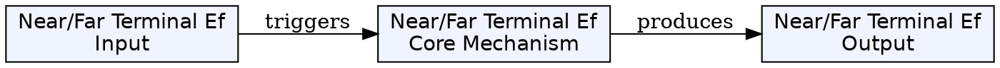
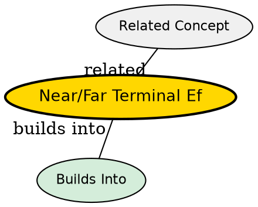

## The Problem
In a network where all mobile devices transmit at the same power level, a device that is very close to the base station will produce a very strong signal at the receiver. A device that is far away will produce a weak signal. When both transmit simultaneously, the strong near signal can completely drown out the weak far signal at the base station receiver, making the far device's transmission undetectable.

## Core Idea
The near/far terminal effect occurs when a strong nearby transmitter and a weak distant transmitter compete for the same receiver. The strong signal's power overwhelms the receiver's front-end, compressing the signal and making the weak signal undecodable -- even if the weak signal uses the same code (as in CDMA) or the same channel (as in TDMA/FDMA).

## How It Works
1. Terminal A is very close to the base station; Terminal B is far away
2. Both transmit at equal power (standard assumption)
3. Terminal A's signal arrives at the base station with high power
4. Terminal B's signal arrives with low power (due to path loss)
5. At the base station receiver, Terminal A's strong signal causes front-end compression or dominates the received energy
6. Terminal B's signal is buried in noise and is completely unreadable -- the "drowning out" effect
7. The base station may fail to decode B's signal even if the noise alone would allow it

In CDMA systems, the near/far effect is particularly devastating because all users share the same frequency.

## Key Properties
- Caused by path loss variation with distance and lack of power control
- Strong signals drown out weak signals at the receiver (SNR collapses)
- Especially severe in CDMA where all users share the same frequency and code
- Strict power control is the solution: base station commands mobiles to adjust transmit power
- Goal: all signals arrive at the base station with equal power (within 1 dB)
- Without power control, CDMA capacity is severely limited

## Visual Explanation

## Semantic Network

## Connections
- Related: [[hidden-terminal-problem|Hidden Terminal Problem]] -- another MAC-layer problem in wireless networks
- Related: [[exposed-terminal-problem|Exposed Terminal Problem]] -- the complementary efficiency problem
- Related: [[csma-cd|CSMA/CD]] -- the Ethernet protocol that fails due to these wireless effects
- Related: [[code-division-multiple-access|CDMA]] -- near/far is especially critical in CDMA due to shared code
- Related: [[power-control|Power Control]] -- the solution to the near/far problem

## Edge Cases & Gotchas
- The near/far problem exists even in TDMA and FDMA if not managed
- In CDMA, one strong user can degrade the entire cell's capacity
- Power control loops must be fast enough to handle rapid mobility
- Near/far is a fundamental reason why CDMA required sophisticated power control before being deployed