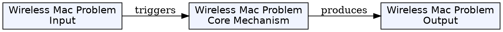
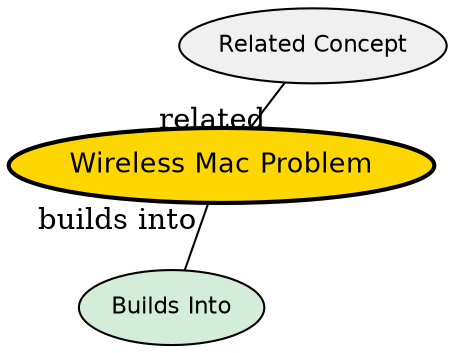

## Framing
This synthesis compares the three fundamental MAC-layer problems in wireless networks: the Hidden Terminal Problem, the Exposed Terminal Problem, and the Near/Far Terminal Effect. These problems arise because standard wired Ethernet mechanisms (CSMA/CD) fail in wireless environments.

## Comparison

| Property | Hidden Terminal | Exposed Terminal | Near/Far Effect |
|---|---|---|---|
| **Root Cause** | Range limitations -- cannot sense | Over-conservative carrier sense | Unequal received power at base station |
| **Who is Affected** | Receiver (B) -- collision at receiver | Transmitter (C) -- unnecessary deferral | Far terminal -- signal drowned |
| **Problem Symmetry** | Symmetric | Symmetric | Asymmetric (near vs. far) |
| **Severity** | Critical (data loss) | Moderate (capacity loss) | Critical (far user blocked) |
| **Solution** | RTS/CTS handshake (MACA) | RTS/CTS announcement | Strict power control |
| **Standard MAC Fails?** | Yes (no collision detection) | Yes (over-deferral) | Yes (equal power assumption) |

## Key Insights

### Why Standard CSMA/CD Fails in Wireless
In wired Ethernet, a transmitting node can detect a collision by monitoring the wire. In wireless, a node cannot hear while transmitting (its own signal drowns out incoming signals). This fundamental asymmetry means:
1. Hidden terminals cannot detect each other's transmissions → collisions occur at the receiver
2. Nodes that sense an ongoing transmission unnecessarily defer → wasted bandwidth

### The Hidden Terminal: The More Severe Problem
Hidden terminals cause data loss -- the receiver gets a garbled signal. The transmitter has no idea a collision occurred. Without RTS/CTS, there is no mechanism to prevent this. MACA's RTS/CTS handshake solves this by explicitly announcing the reservation zone to all neighbors, including hidden nodes.

### The Near/Far Effect: Structural Asymmetry
The near/far effect is fundamentally different from the other two: it is caused by the physics of radio propagation, not by range limitations. A near device's signal is not stronger because it is transmitting more -- it is stronger because of path loss. All devices transmit at the same nominal power, but the inverse square law means close devices produce overwhelming signals at the base station. Power control (not MAC protocols) is the solution.

### Practical Implications
- **MACA + RTS/CTS:** Solves hidden and exposed terminal problems; used in 802.11
- **Power Control:** Solves near/far problem; critical in CDMA
- These mechanisms are often combined in modern wireless systems (802.11 + power control, CDMA + MACA)

## Visual Explanation

## Semantic Network

## Connections
- [[hidden-terminal-problem|Hidden Terminal Problem]] -- collision at the receiver
- [[exposed-terminal-problem|Exposed Terminal Problem]] -- unnecessary deferral
- [[near-far-terminal|Near/Far Terminal Effect]] -- drowning out of weak signals
- [[maca|MACA]] -- the protocol that solves hidden/exposed terminal
- [[csma-cd|CSMA/CD]] -- the wired protocol that fails in wireless